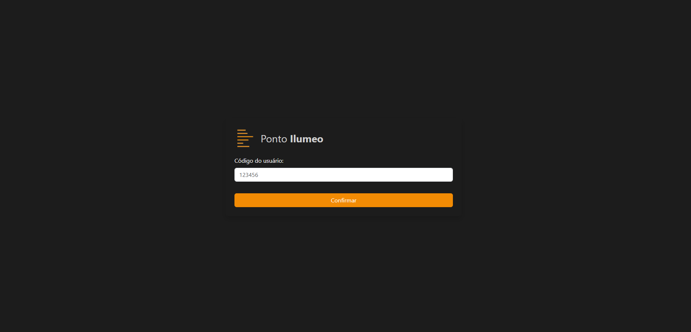
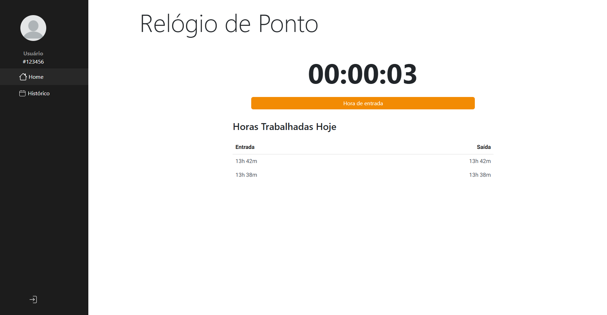
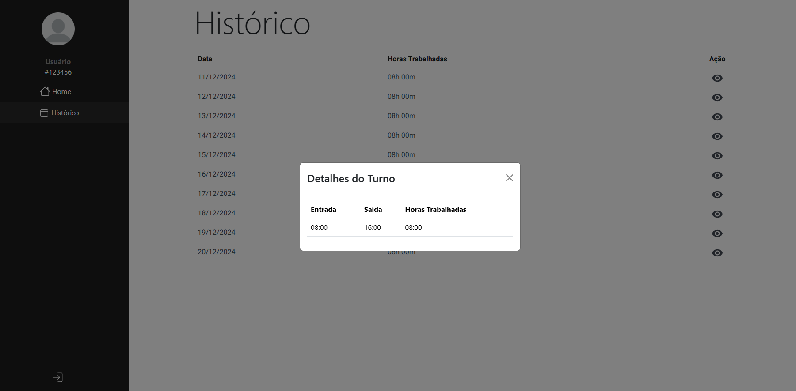

# Sistema de Controle de Pontos Ilumeo

## Descrição

Este projeto consiste em uma aplicação de controle de ponto, desenvolvida com Node.js e React, utilizando TypeScript. A aplicação permite registrar as entradas e saídas dos colaboradores, simulando o controle de ponto de uma empresa. Além disso, exibe o histórico das horas trabalhadas por dia e apresenta uma tabela com os registros do dia.
Quando um ID ou matrícula já existe, os dados são recuperados corretamente; caso contrário, uma nova matrícula é criada automaticamente.

## Funcionalidades

### Página de Login
- Permite que o usuário insira seu ID para acessar o sistema.



### Página Home
- **Timer:** Exibe a quantidade de horas trabalhadas no dia de forma atualizada. Ao registrar a entrada, o timer começa a contar automaticamente as horas, minutos e segundos trabalhados até que a saída seja registrada.
- **Horas Trabalhadas Hoje:** Exibe o histórico de entradas e saídas do dia atual, no formato de hora.



### Página de Histórico de Horas Trabalhadas
- Exibe uma lista de todos os dias trabalhados e a quantidade de horas trabalhadas em cada um.
- O usuário pode clicar no ícone de "olho" para visualizar os detalhes de entrada e saída de cada dia registrado.




## Tecnologias 

- Node.Js
- React.JS
- Postgres
- Jest
- Typescript
- Docker

## Deploy
O deployment do backend da aplicação foi realizado no Render, enquanto o frontend está hospedado no Vercel.

Importante: devido ao uso dos planos gratuitos tanto no Render quanto no Vercel, o servidor entra em stand-by e é ativado apenas com a primeira requisição. Por esse motivo, as ações iniciais na aplicação podem apresentar um tempo de resposta mais longo do que o habitual.

- Frontend: https://sistema-de-controle-de-ponto-git-main-mirielle-rosas-projects.vercel.app/

- Protótipo no Figma: https://www.figma.com/design/oyQxyfaAoyvYhdRIAt9CK9/Prot%C3%B3tipo-Poto-Ilumeo?node-id=0-1&m=dev&t=FvwSYBYyxvz5mDII-1

# Configuração do projeto

## Backend
Acesse o diretório do backend:

```
    cd .\backend\
```

### Docker:
Para iniciar a aplicação com Docker, execute o comando:
```
    docker-compose up
```

### Manualmente:

1. **Instale as dependências**:

Execute o seguinte comando para instalar as dependências necessárias:

```
   npm install
```

2. **Construa a aplicação**:
Para compilar a aplicação, use o comando:
```
  npm run build
```

3. **Inicie a aplicação**:
Para iniciar a aplicação, execute o comando:
```
npm start
```


## Frontend
Acesse o diretório do frontend:
```
    cd .\frontend\
```

### Docker:
Para iniciar a aplicação com Docker, execute o comando:
```
    docker-compose up
```

### Manualmente:


1. **Instale as dependências**:
Execute o comando abaixo para instalar as dependências necessárias:
```
  npm install
```

2. **Inicie a aplicação**:
Para iniciar a aplicação, use o comando:
```
npx vite
```
